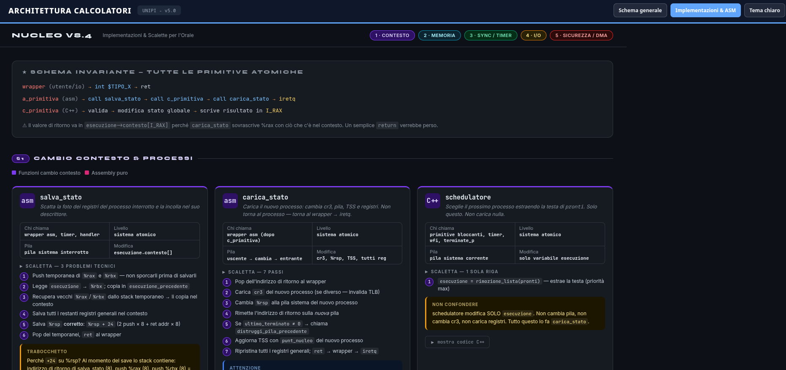

# ARCH-EXPLORER 64

**ARCH-EXPLORER 64** è un'applicazione web interattiva per ripassare l'architettura del calcolatore e il nucleo didattico del corso di **Calcolatori Elettronici (UNIPI)**.

🚀 **Prova l'app qui**: [archexplorer64.vercel.app](https://archexplorer64.vercel.app/)

## Contenuti

L'app riunisce due strumenti nello stesso ambiente:

* **Schema generale dell'architettura**: una mappa interattiva dei blocchi principali del sistema, con CPU, MMU, TLB, cache, RAM, bus, APIC, dispositivi di I/O, DMA, page table e nucleo.
* **Sidebar di ripasso**: ogni blocco apre spiegazioni mirate all'orale, collegamenti tra componenti, immagini e schemi del materiale di studio.
* **Implementazioni e ASM**: una sezione dedicata alle primitive e al codice del nucleo, con schede colorate su `salva_stato`, `carica_stato`, scheduler, semafori, timer, I/O, processi esterni, `access()` e preparazione delle PRD per il DMA.
* **Percorsi d'esame**: i contenuti sono organizzati per collegare teoria, segnali hardware, memoria virtuale, interrupt, DMA e implementazione effettiva del kernel didattico.

## Argomenti Coperti

* Pipeline, hazard, branch prediction, esecuzione fuori ordine, rinomina e ROB.
* Traduzione degli indirizzi, page table a quattro livelli, TLB, bit di protezione, huge pages e finestra fisica.
* Bus di sistema, cicli di lettura/scrittura, wait states, PCI, BAR e bus mastering.
* Interrupt, APIC, IDT, cambio di privilegio, frame di interrupt e ritorno con `iretq`.
* Strutture del nucleo didattico: processi, contesto, scheduler, semafori, timer, driver, processi esterni e controlli sui buffer utente.

## Implementazione

L'app è un singolo file HTML pensato per essere facilmente pubblicabile come sito statico. Lo schema generale usa React 18 e SVG inline per disegnare i blocchi e gestire la sidebar; i contenuti sono raccolti in una struttura dati JavaScript incorporata nel file.

La sezione **Implementazioni e ASM** è integrata come vista interna nello stesso file, mantenendo le schede originali e il loro stile a card. Il tema chiaro/scuro è condiviso tra schema e implementazioni, così la navigazione resta coerente anche passando da una vista all'altra.

Non sono richiesti passaggi di build per consultare l'app pubblicata: la versione da usare è quella esposta su Vercel.

---

***Progetto personale non ufficiale, realizzato per supportare la preparazione all'esame di Calcolatori Elettronici (UNIPI).***
