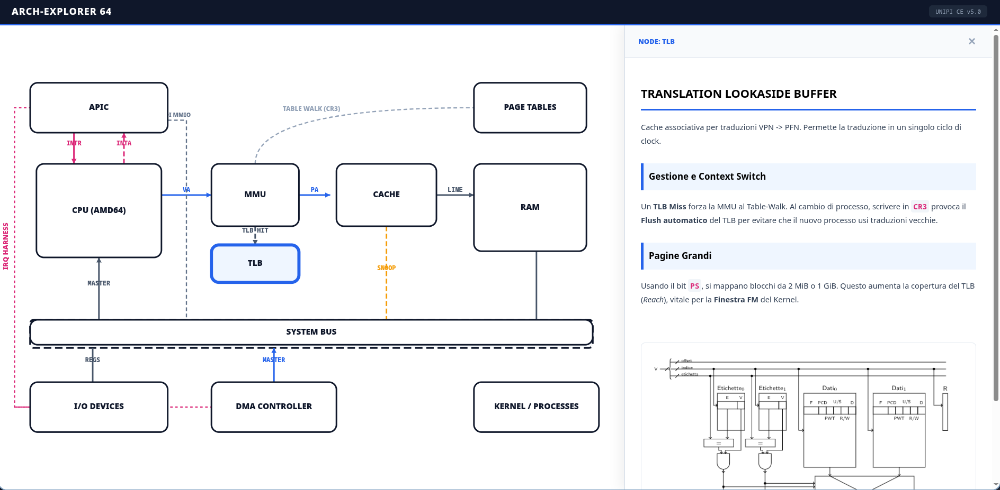

# ARCH-EXPLORER 64 ◈ Interactive Hardware Model

**ARCH-EXPLORER 64** è un'applicazione web interattiva progettata per visualizzare e analizzare in dettaglio l'architettura completa del calcolatore (AMD64 / PCI), basata rigorosamente sul corso di **Calcolatori Elettronici (UNIPI)**.

🚀 **Prova l'app qui**: [archexplorer64.vercel.app](https://archexplorer64.vercel.app/)

## Finalità

L'app nasce come strumento avanzato di supporto allo studio per l'esame orale. Permette di navigare visivamente tra i componenti hardware e approfondire i meccanismi micro-architetturali del sistema, rendendo esplicite le connessioni tra teoria e implementazione reale del Kernel.

## Stack Tecnologico

Sviluppata con un approccio focalizzato sulla portabilità e sulle prestazioni:

- **React 18**: Gestione dello stato e dell'interattività dei componenti.
- **SVG Dinamico**: Diagramma ad alta fedeltà con mappatura dei segnali hardware (VA, PA, INTR, INTA, IRQ, Bus Control).
- **Vanilla CSS**
- **Zero-Build Architecture**: Progettata per essere eseguita istantaneamente nel browser senza necessità di build step complessi (CSR tramite Babel in-browser).

## Funzionalità Chiave

- **Schema Hardware Completo**: Rappresentazione dettagliata di CPU, MMU, TLB, Cache, RAM, Page Tables, APIC, DMA e System Bus.
- **Documentazione Integrata**: Oltre 500 righe di teoria specifica (terminologia d'esame) consultabili cliccando sui singoli nodi.
- **Visual Evidence**: Integrazione di oltre 25 diagrammi originali e cronogrammi estratti dalle dispense ufficiali del corso.
- **Hardware Signaling**: Visualizzazione esplicita dei percorsi dati e dei segnali di controllo (M/IO#, W/R#, EOI MMIO, ecc.).
